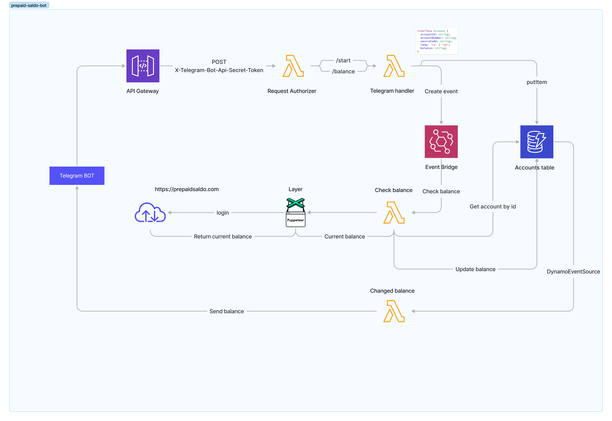

# Presaldo telegram bot

The main idea of this project is to help my wife manage money that she receives as help from the NL government. It parses
`https://prepaidsaldo.com` and send to telegram the current balance.

## Table of Contents

- [Quick start](#install)
- [Schema](#schema)


## Install
1. First and foremost you need to create **aws account**
> How to create an AWS account see [here](https://aws.amazon.com/ru/premiumsupport/knowledge-center/create-and-activate-aws-account/)
2. Clone the repo 
```shell
    git clone https://github.com/pedchenkoroman/presaldo-telegram-bot.git
```
3. Create `.env` file and set `BOT_TOKEN`
```shell
    cp .env.example .env
```
> How create a telegram bot see [here](https://core.telegram.org/bots/api)

4. Install dependency
```shell
    npm install
```
5. Call `aws cdk synth` to generate a template and check that everything is okay 
```shell
  npx aws cdk synth
```
6. Call `aws cdk deply` command to deploy the stack to `cloud formation` and setup all resources
```shell
npx aws cdk deploy
```
7. Due to the fact that the lambda that automatically adds to the dynamo DB account number and security code has not been ready yet.
   You need to open the AWS  console, navigate to dynamo DB and create a record in the accounts' table where `accountId` - telegram account id,
   `accountNumber` - the number of your maestro card, `secureCode`  - also the code from your maestro card.

## Schema

